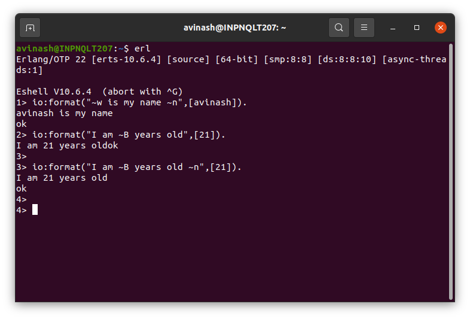
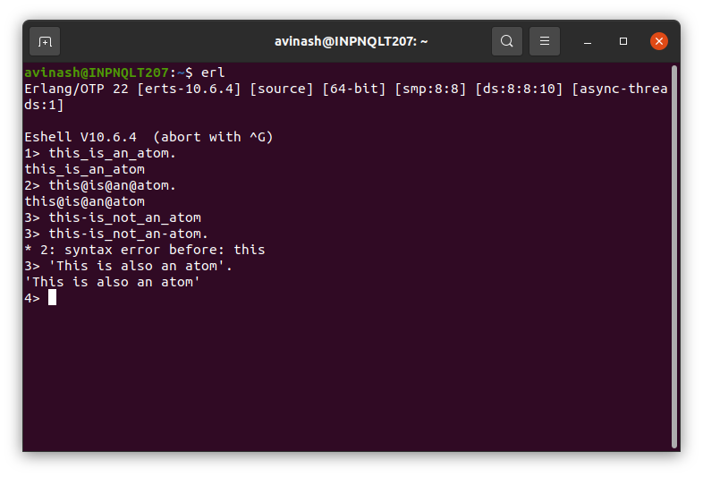

Week 1

Create Variables in the Shell

Seeing Your Bound Variables

Clearing Bound Variables in the Shell

formatting output using io:format

Create atoms

List Basic Operations
Spilting List into Head and Tail
